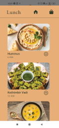
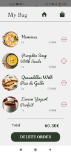

**React Native Food Command App**

 

> This is my first React-Native app coded from scratch by myself :sunglasses:
>
> The starting point was just a little challenge for me :
> trying to reproduce a given style,
> and then the App has slowly grown...

 

> Choose to manage navigation by using different Modals  
> (really need to improve that because of require cycles possible issues... but again, it was just a question of style rendering )
>
> Use AsyncStorage and useState to manipulate datas

 

> Testing Android mobile rendering with Expo App, so do not know IOS rendering (working on Windows...)

 

Thanks to [Olga Vajagić](https://dribbble.com/shots/14820779--App) for the whole style ideas :ok_hand:

 

 &ensp; &ensp;  &ensp; &ensp;  &ensp; &ensp;

 
 

 &ensp; &ensp;  &ensp; &ensp;
